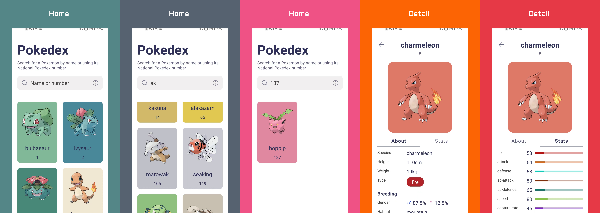

# 											神奇宝贝图鉴

:shit:完全基于Jetpack Compose，结合Coroutine，Flow，Retrofit，Jetpack（Hilt，WorkManager，ViewModel，Room，DataStore）等现代Android开发工具的神奇宝贝图鉴。:pushpin: MVI :heavy_plus_sign: Repository Pattern :heavy_plus_sign: Recommed Architecture :heavy_plus_sign: Modularization.




## Teck-stack

- min SDK 23, compile SDK 32.
- :100:Kotin based, Coroutine and Flow for asynchronous.
- Jetpack Compose: For UI, no xml anymore.
  - Compose Navigation: Navigation between Composables
  - Compose ConstraintLayout: `ConstraintLayout` is a layout that allows you to place composables relative to other composables on the screen
  - Material: This is the higher level entry point of Compose, designed to provide components that match those described at www.material.io.
- Acompanist: Accompanist is a group of libraries that aim to supplement [Jetpack Compose](https://developer.android.com/jetpack/compose) with features that are commonly required by developers but not yet available.
  - systemUIController: A library that provides easy-to-use utilities for recoloring the Android system bars from Jetpack Compose.
  - pager: A library that provides utilities for building paginated layouts in Jetpack Compose, similar to Android's [ViewPager](https://developer.android.com/reference/kotlin/androidx/viewpager/widget/ViewPager).(In fact, it has some bugs right now, but it' s ok)
- Jetpack
  - Lifecycle: Observe Android lifecycles and handle UI states upon the lifecycle changes.
  - ViewModel: Manages UI-related data holder and lifecycle aware. Allows data to survive configuration changes such as screen rotations.
  - Room: Constructs Database by providing an abstraction layer over SQLite to allow fluent database access.
  - Proto DataStore: A data storage solution that allows you to store key-value pairs or typed objects with [protocol buffers](https://developers.google.com/protocol-buffers)
  - [Hilt](https://dagger.dev/hilt/): for dependency injection.
  - WorkManager: [WorkManager](https://developer.android.com/reference/androidx/work/WorkManager) is the recommended solution for persistent work
- Splash Screen: Compatible with Android12 default splash screen.
- Coil: Load image from network.
- Palette: Extract representative color palettes from images.
- [Retrofit2 & OkHttp3](https://github.com/square/retrofit): Construct the REST APIs and paging network data.
- [Sandwich](https://github.com/skydoves/Sandwich): Construct a lightweight and modern response interface to handle network payload for Android.
- Gson: Used to convert network response to Java objects.


## Architecture

#### Separation of concerns

Programming with jetpack compose naturally applies this principle

#### Drive UI from data models

Another important principle is that you should drive your UI from data models, preferably persistent models. Data models represent the data of an app. I apply [domain specific models](https://blog.danlew.net/2022/08/15/domain-specific-models/) in this project. There are dto models(from network), entity models(save in database) and UI models(show in UI).And use a mapper file that contains some functions to transform between them.

#### Single source of truth

When a new data type is defined in your app, you should assign a Single Source of Truth (SSOT) to it. The SSOT is the *owner* of that data, and only the SSOT can modify or mutate it.

#### Unidirectional Data Flow

The [single source of truth principle](https://developer.android.com/topic/architecture?hl=en#single-source-of-truth) is often used in our guides with the Unidirectional Data Flow (UDF) pattern. In UDF, **state** flows in only one direction. The **events** that modify the data flow in the opposite direction.


[More info about recommended best practices.](https://developer.android.com/topic/architecture?hl=en#separation-of-concerns), I just copy form here.


## License

```
Pokedex to show Pokemons
Copyright (C) 2022  JeckOnly

This program is free software: you can redistribute it and/or modify
it under the terms of the GNU General Public License as published by
the Free Software Foundation, either version 3 of the License, or
(at your option) any later version.

This program is distributed in the hope that it will be useful,
but WITHOUT ANY WARRANTY; without even the implied warranty of
MERCHANTABILITY or FITNESS FOR A PARTICULAR PURPOSE.  See the
GNU General Public License for more details.

You should have received a copy of the GNU General Public License
along with this program.  If not, see <https://www.gnu.org/licenses/>.
```


